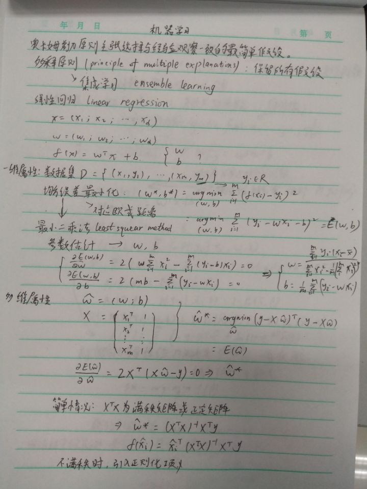
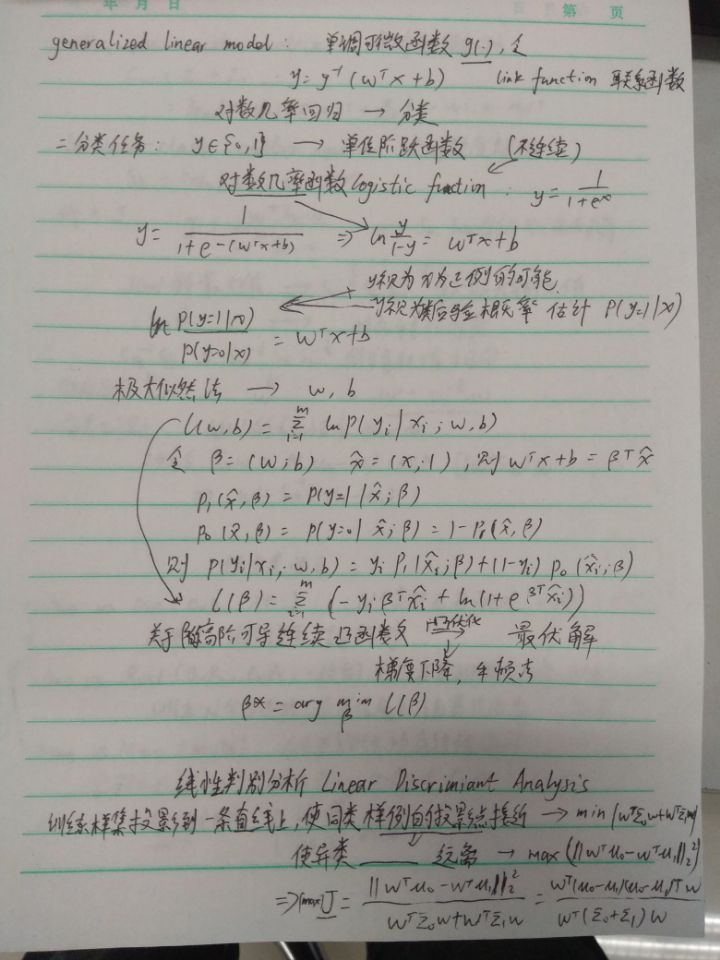
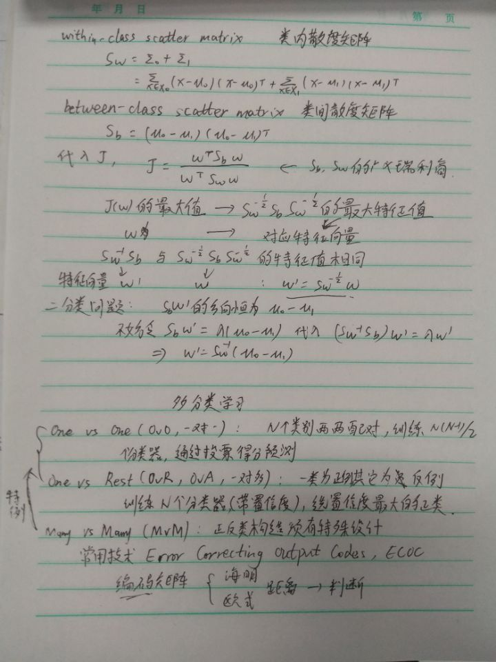

# 1.绪论 3.线性模型 笔记

NFL：无论学习算法多聪明，学习算法多笨拙，它们的期望性能竟
然相同！这就是“没有免费的午餐”定理（No Free Lunch Theorem，简称NFL）。

我们需注意到，NFL定理有一个重要前提所有“问题”出现的机会相同、或所有问题同等重要，但实际情形并不是这样.很多时候，我们只关注自己正在试图解决的问题（例如某个具体应用任务），希望为它找到一个解决方案至于这个解决方案在别的问题、甚至在相似的问题上是否为好方案。

所以，NFL定理最重要的寓意，是让我们清楚地认识到，脱离具体问题，空泛地谈论“什么学习算法更好”毫无意义，因为若考虑所有潜在的问题，则所有学习算法都一样好。**要谈论算法的相对优劣，必须要针对具体的学习问题；在某些问题上表现好的学习算法，在另一些问题上却可能不尽如人意，学习算法自身的归纳偏好与问题是否相配，往往会起到决定性的作用。**

线性模型的内容与之前学过的数理统计，矩阵论相似，笔记如下图。

<!--  -->

>参考链接

<https://www.cnblogs.com/pinard/p/6244265.html>
